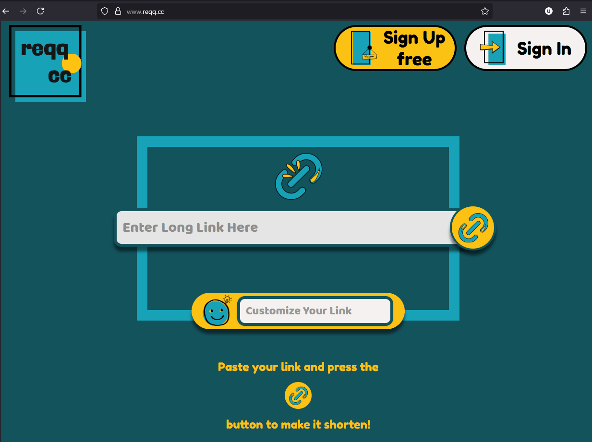

# Hi, I'm Umut 👋

## Software Engineer | TypeScript, React, Next.js | Real-time Data Visualization & IoT

I build performant, scalable web applications and love exploring new technologies. Currently open to software–engineering roles in React and web ecosystems.

---

## 🚀My Top Projects
My focus is on building high-impact, production-grade applications. Here are my two top projects that best represent my skills.

### [ColdTrace](https://coldtrace.app/) | Real-time IoT Monitoring Platform
A real-time IoT monitoring platform built with Next.js, GraphQL Subscriptions, Recharts, and Leaflet. Architected to handle over 10,000 updates per second for live temperature tracking, device mapping, and anomaly detection.

_Tech_: Next.js, TypeScript, GraphQL (Subscriptions), Zustand, Recharts, Leaflet, PostgreSQL, Docker, Turborepo, shadcn/ui

---

### [Reqq.cc](https://reqq.cc) – Privacy‑minded URL Shortener
A high-performance URL shortener built with Next.js 15 Edge Runtime and Redis. Achieves sub-40ms redirect latency and eliminates race conditions with an atomic Postgres click-tracking system.

_Tech_: Next.js (Edge Runtime), React 19, TypeScript, Supabase (Postgres), Redis, Vitest

---

## 👨‍💻 About Me & My Stack
* Current Work: Serving as a Founding Engineer (Contract) at Tracius, where I am architecting a multi-tenant, GS1-compliant (EPCIS 2.0) traceability platform using NestJS, AWS Cognito, and a Turborepo monorepo.
* Core Stack: TypeScript, React, Next.js, Node.js, NestJS, GraphQL, PostgreSQL, Redis, AWS, Azure, Docker, Zustand, Recharts, Leaflet.
* Education & Certs:
  * Pursuing M.S. in Software Engineering @ Western Governors University (Exp. 2026).
  * AWS Certified Cloud Practitioner
  * Azure Fundamentals (AZ-900)
  * GraphQL Associate (Apollo)

---

## 🔥 GitHub Stats

---

## 🏆 Trophies

---

## 🐍 Contribution Graph

---

## 🙋‍♀️ Let's Connect

[Email](mailto:utoker@gmail.com) · [GitHub](https://github.com/utoker) · [LinkedIn](https://www.linkedin.com/in/utoker/)
