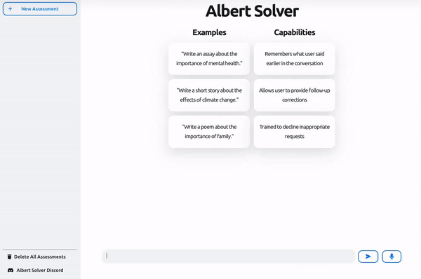

<h1 align="center">Hi , I'm Umut </h1>

<h4 align="center">
I'm a React developer based in New York 🗽, I have a passion for building web applications and I love to learn new technologies.  
</h4>
 

<table bordercolor="#66b2b2" align="center">
  <thead>
  <h1 align="center">Projects</h1>
  </thead>
  <tbody>
  <tr>
  <td colspan="2">
  <h2 align="center">Albert Solver</h3>
 
<a target="_blank" href="https://github.com/utoker/albert-solver/tree/main/">

</a>
 

  
  <!--  -->
      

        
<strong>TypeScript / Next / Prisma / NextAuth / NextUI / SWR / Stripe</strong>

        
This project aims to provide a comprehensive solution for expert assistance with essays and homework using cutting-edge AI technology, powered by OpenAI's GPT-3 language model. The AI model is integrated with a web application built using modern web technologies such as TypeScript, Next.js, NextAuth.js, NextUI, Prisma, SWR, React and Stripe for handling subscriptions.

  </td>
  </tr>
  <tr>
  <td width="50%" valign="top">
<h3 align="center">Food Check App</h3>
 
<a target="_blank" href="https://github.com/utoker/food-check/tree/main/">

</a>
 

  
  <!--  -->
      

        
<strong>JavaScript / React Native</strong>

        
Food Check is a simple barcode grocery scanner that lets you quickly discover a food's ingredient information.

    </td> 
    <td width="50%" valign="top">
      <h3 align="center">Reqq.cc Link Shortener</h3>
         
        

        
        

         
        

          
    
  
      

        
<strong>TypeScript / Next.js / Prisma</strong>
 
        
The reqq.cc is an easy-to-use link shortening service with an option to use custom URLs.

I developed this web application as a free alternative to paid services like bit.ly or tinyurl.com.

</td>
  </tr>
  <tr>
    <td width="50%" valign="top">
      <h3 align="center">Food Data</h3>
         
        

      
        

         
        

          
  
  
      

        
<strong>JavaScript / React / Next.Js</strong>
 
        
Food Data is a web app for getting nutrient profile data of requested food from the United States Department of Agriculture's Food Database with Rest API.

</td>

   <td width="50%" valign="top">
      <h3 align="center">Search NPM</h3>
         
        
         
        

          
    
  
      

        
<strong>TypeScript / Redux / React</strong>

        
 A web app for searching node packages with the implementation of npms.io API for the TypeScript programming environment. More information about npms.io and its API can be found at their GitHub repository.

I did this project to implement React-Redux in a TypeScript environment and use it as a boilerplate for my following projects.

</td>
  </tr>
  <tbody>
</table>

## 🔥 Streak Stats

 

## 🏆 Trophies

   

 
<!-- 
 -->

## ⚡ Recent GitHub Activity

## 🐍

   
  

  

## 🙋‍♀️ Let's Connect

	
	
	

